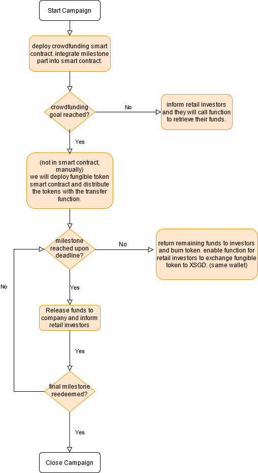

# CapstoneDemo
Zilliqa Equity Crowdfunding Platform 

## Getting started 
how to use zilpay/scilla IDE
https://dev.zilliqa.com/docs/dev/dev-started-helloworld/

explanation of the smart contracts
https://scilla.readthedocs.io/en/latest/scilla-trial.html

react dapp
https://github.com/Zilliqa/dev-portal-examples/tree/master/hello-world

## Progress

| Timeline                                                                                                                                | Procedure                                                                                      | Status                                                                                                                                                                                                   | Implementation details                                                                                                                                                                                          |
| --------------------------------------------------------------------------------------------------------------------------------------- | ---------------------------------------------------------------------------------------------- | -------------------------------------------------------------------------------------------------------------------------------------------------------------------------------------------------------- | --------------------------------------------------------------------------------------------------------------------------------------------------------------------------------------------------------------- |
| Review 3                                                                                                                                | Edit Fungible Token Smart Contract (Transfer function can only be initiated by contract owner) | done                                                                                                                                                                                                     | The corresponding function of Transfer is the TransferFrom function which is removed. Add CodeIsContractOwner checks for existing functions; previously procedures and transitions checked for different users. |
|| Write Javascript to deploy Fungible Token Smart Contract (Figure 2) and call the relevant functions from smart contract                 | done                                                                                           | Added automatic saving of deployed smart contract address which is needed to call functions from smart contract. Refactored into two scripts, one for deployment only and another for calling functions. |
|| Write out Milestone Smart Contract (Functions for contract owner to call to approve milestones, claimback balance if startup fails etc) | done                                                                                           | Implemented logic (ie. Milestone 2 can only be redeemed after Milestone 1 is redeemed, check if deadline is over, check if this is owner accessible )                                                    |
|| Write Javascript to deploy Milestone Smart Contract and call the relevant functions from smart contract                                 | done                                                                                           | Need to add transition AddFunds() in order to deploy contract with funds.                                                                                                                                |
|| Integrate Javascript for deploy + transitions in FungibleToken, Milestone with Backend                                                  |                                                                        done                        | Refactor.                                                                                                                |
| Review 4                                                                                                                                | Edit Crowdfunding smart contract                                                               |                 done                                                                                                                                                                                         |              set deadline + can only set campaign to succeed after campaign deadline elapsed                                                                                                                                                                                         |
|| Integrate crowdfunding and milestone smart contract                                                                                     |           done                                                                                     |                       need to change how milestone refunds retail investors but that will be done after we integrate fungible token smart contract.                                                                                                                                                                                   |
||    Integrate fungible token smart contract                                                                                 |                                                                                                |         Add burn function to exchange fungibleToken for ZIL                                                                                                                                                                                                  |
|| Get smart contract to accept XSGD rather than ZIL                                                                                             |                                                                                                |                                                                                                                                                                                                          |
||Write Javascript to deploy integrated Milestone Smart Contract and call the relevant functions from smart contract                                                                                       |                                                                                                |                                                                                                                                                                                                          |

other concerns
- Also need to manage error code output for smart contracts on api                      
## Flowchart for FungibleToken

***

## [Outdated 2] Progress
| Procedure                                                                                                                                                                                                                                                                                                                                                                                                                                             | Status | Implementation details                                                                                                                                                                                                                                                                                                               |
| ----------------------------------------------------------------------------------------------------------------------------------------------------------------------------------------------------------------------------------------------------------------------------------------------------------------------------------------------------------------------------------------------------------------------------------------------------- | ------ | ------------------------------------------------------------------------------------------------------------------------------------------------------------------------------------------------------------------------------------------------------------------------------------------------------------------------------------ |
| Userflow for campaign to identify which parts are supposed to be done with smart contract                                                                                                                                                                                                                                                                                                                                                             | done   |                                                                                                                                                                                                                                                                                                                                      |
| Edit FungibleToken.scilla smart contract for: (1)Transfer function can only be initiated by contract owner(2)Some way to replace variables to be inserted (i.e. TOKEN name, total token supply etc) before contract creation (Since there are likely multiple startups on our platform)(3)Burn function (If not found, Only by contract owner) -> return the money to the token holder(%) then burn token to cancel contract if startup fails etc |        | (1)The corresponding function is the TransferFrom function which is removed(2)Add CodeIsContractOwner checks for existing functions; previously procedures and transitions checked for different users(3)Already implemented in template smart contract.(4)Should burn function be implemented by sending it to trash address? |
| Write out SampleMilestone.scilla(1)Transitions for contract owner to call to approve milestones, cancel contract if startup fails etc                                                                                                                                                                                                                                                                                                               |        |                                                                                                                                                                                                                                                                                                                                      |
| Intergrate SampleMilestone.scilla with locked funds                                                                                                                                                                                                                                                                                                                                                                                                   |        |                                                                                                                                                                                                                                                                                                                                      |
| Javascript to deploy and interact with smart contract                                                                                                                                                                                                                                                                                                                                                                                                 |        |                                                                                                                                                                                                                                                                                                                                      |
| Userflow for secondary market                                                                                                                                                                                                                                                                                                                                                                                                                         |        |                                                                                                                                                                                                                                                                                                                                      |
| Edit FungibleToken.scilla smart contract for secondary market                                                                                                                                                                                                                                                                                                                                                                                         |        |                                                                                                                                                                                                                                                                                                                                      |
| Javascript to deploy and interact with smart contract (secondary market)                                                                                                                                                                                                                                                                                                                                                                              |        |                                                                                                                                                                                                                                                                                                                                      |

## [Outdated] Progress
| Procedure                                                                                                                                       | Status | Implementation details                                                                                                                                                                             |
| ----------------------------------------------------------------------------------------------------------------------------------------------- | ------ | -------------------------------------------------------------------------------------------------------------------------------------------------------------------------------------------------- |
| Set up Developer Environment for Zilliqa smart contract                                                                                         | done   | Neo Savant IDE, Zilpay                                                                                                                                                                             |
| Test out Crowdfunding.scilla                                                                                                                    | done   |                                                                                                                                                                                                    |
| Test out FungibleToken.scilla (1: able to distribute tokens to holders)                                                                         | done   | See Flow for fungible token.1                                                                                                                                                                      |
| Test out FungibleToken.scilla (2: secondary market - able to redistribute token holder from holders to secondary market recipient)              | done   | See Flow for fungible token.2                                                                                                                                                                      |
| Test out FungibleToken.scilla (3: secondary market - able to redistribute tokens from secondary market recipient to secondary market recipient) | done   | See Flow for fungible token.3 Implementation is possible but in real life would probably have problems in execution because of atomicity. Need to rework if decide to implement secondary market. |
| Combine Crowdfunding.scilla and FungibleToken.scilla                                                                                            |        |                                                                                                                                                                                                    |
| Write out SampleMilestone.scilla                                                                                                                |        |                                                                                                                                                                                                    |
| Combine SampleMilestone.scilla                                                                                                                  |        |                                                                                                                                                                                                    |
| Add oracle to read endDate for Crowdfunding.scilla – currently it uses endBlock to end Crowdfunding campaign                                    |        |                                                                                                                                                                                                    |
|                                                                                                                                                 |        |                                                                                                                                                                                                    |

## [Outdated] Flow for fungible token 
1.	smart_contract_owner needs to IncreaseAllowance() + Transfer()
2.	For secondary market market scenario 1: token holder -> secondary market recipient, smart_contract_owner needs to IncreaseAllowance()  +  tokenholder needs to TransferFrom() where the from is the address of smart_contract_owner
3.	For secondary market market scenario 2: secondary market recipient -> secondary market recipient, smart_contract_owner needs to IncreaseAllowance()  +  tokenholder needs to TransferFrom() where the from is the address of smart_contract_owner

## References
https://forum.openzeppelin.com/t/how-to-create-an-erc20-token-with-burn-and-stop-burn-feature/1048/4

https://scilla.readthedocs.io/en/latest/scilla-in-depth.html#list
